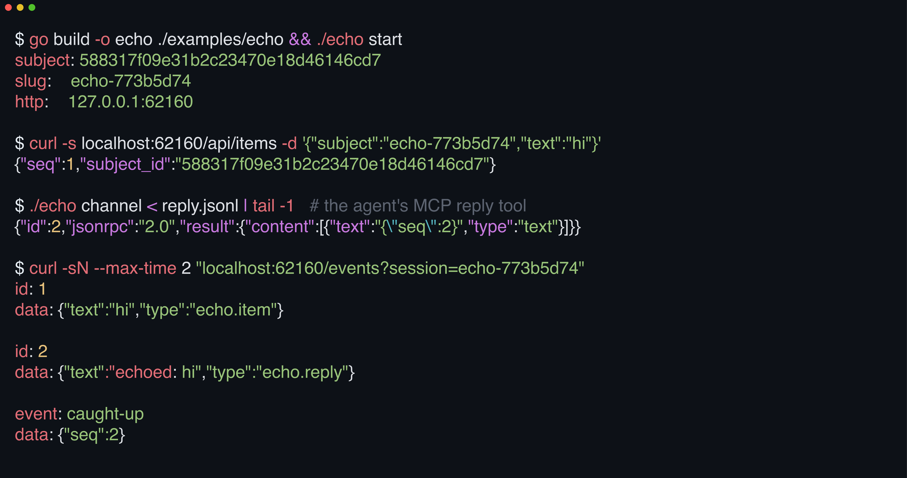

# 

**Never write a daemon for a Claude Code tool again.** cc-interact extracts cc-review's daemon, event log, SSE, edit gate, and MCP plumbing into a reusable Go framework; the echo example is 381 lines.

[](https://github.com/yasyf/cc-interact/actions/workflows/ci.yml)
[](https://github.com/yasyf/cc-interact/tags)
[](LICENSE)

## Get started

```bash
go get github.com/yasyf/cc-interact
```



That run is [`examples/echo`](examples/echo), end to end. Two domain handlers, one REST mount, and one MCP tool exercise the whole framework. A human POSTs an item, the agent replies through its channel, and both events come back off the same `/events` plane a browser would read.

Driving with an agent? Paste this:

```text
Run `go get github.com/yasyf/cc-interact` in my Go project.
Study https://github.com/yasyf/cc-interact/tree/main/examples/echo — a complete headless consumer — then stand up a human-in-the-loop surface for my domain: start/reply handlers, a REST mount, and one MCP channel tool.
Verify the round trip: POST an item to the daemon's REST plane and confirm the agent's reply streams back over /events.
```

---

## Use cases

### Block agent edits until a human signs off

A review tool that can't stop the agent from editing mid-review is a suggestion box. Inject the verdict as one function:

```go
daemon.Config{
	// cc-review: block while a review is open.
	Gate: func(ctx context.Context, s subject.Subject, tool daemon.ToolCall) (bool, string) {
		return s.Status != "open", "a human is still reviewing — reply to their comments first"
	},
	GateErrorReason: "review state unreadable; blocking edits",
}
```

The `guard-edit` hook routes every edit the Claude session attempts through this verdict. While the subject is open, Claude sees your reason instead of a completed write. Errors reading the subject fail closed (`GateErrorReason`), and a missing daemon fails open, so a crashed daemon never bricks the session.

### Feed one gap-free event log to the browser and the agent alike

A socket for the UI plus polling for the agent gives you two realtime paths that drift, drop events, and disagree after a reconnect. Here both roles read one log:

```bash
mkdir -p "$HOME/.cc-echo/bin"
go build -o "$HOME/.cc-echo/bin/echo" ./examples/echo
"$HOME/.cc-echo/bin/echo" watch
```

`watch` streams the same append-only log as the browser's `/events`, one JSON event per line, with `exclude_origin=agent` so the agent never reacts to its own echo. Delivery is at-least-once with a persisted per-consumer cursor, so a dropped connection resumes where it left off, and the consumer survives a daemon swap.

### Ship your agent surface as a Claude Code plugin

The binary is half the ship surface; the MCP server wiring, session hooks, and start skill that make up the plugin payload are their own pile of boilerplate. Render it instead:

```bash
./plugin-template/render.sh out/ PLUGIN_NAME=mytool DISPLAY_NAME=MyTool \
  BINARY_NAME=mytool RELEASE_REPO=you/mytool \
  MCP_SUBCOMMAND=channel SKILL_NAME=mytool:start
```

You get cc-review's plugin payload with the review strings swapped for yours. The rendered tree carries the channel MCP server wiring, a capt-hook hook pack (session record, edit guard, and the optional agent-steering plane — dispatched by the captain-hook plugin the manifest declares as a dependency), and a start skill; the release-binary installer arrives separately, as a cc-guides fragment layout in your plugin's repo. [`plugin-template/`](plugin-template) documents every variable, the pack contract, and the installer layout.

## What the framework owns

One process model, shipped. A lazily spawned daemon owns a single-writer SQLite (WAL) holding an append-only per-subject event log; the browser, `watch`, and the MCP channel all read the same SSE plane; newest-wins eviction upgrades the daemon in place when a newer binary lands. You register domain ops against a generic control envelope and the framework routes the rest.

| Package | Owns |
|---|---|
| `daemon` | lazy spawn, newest-wins eviction, peer-credential identity, the op registry, the edit gate |
| `store` | pure-Go SQLite holding subjects plus the event log; your tables via a migrate hook |
| `event` | the log-entry type and the per-subject pub/sub wakeup |
| `sse` | the HTTP `/events` plane, at-least-once SSE with `Last-Event-ID` resume |
| `consume` | the agent-side SSE client with a persisted resume cursor |
| `channel` | the stdio MCP server, tools in and notifications out |
| `cmd` | ready-made `daemon`, `watch`, `status`, and `stop` cobra constructors plus the hidden hook and channel entry points |
| `subject` | ownership, one subject per window and scope, stable across `/clear` and compaction |
| `paths` | the `~/.<app>` state layout of socket, DB, HTTP handshake, and locks |
| `vcs` | optional git/jj working-copy snapshots and the per-prompt turn ledger |

## The browser UI is opt-in

A headless consumer never imports it. When you want a diff-style web client:

```bash
npm install @cc-interact/react
```

Mount `sse.StaticHandler` on the daemon and the React package's stream and query primitives read the same `/events` plane as everything else.

## State

`state.db`, `daemon.sock`, `http.json`, and `daemon.log` all live under one `~/.<app>/` directory. There are no schema migrations. Your migrate hook adds domain tables idempotently, and a core schema change means wiping the directory. The echo example carries no domain tables, so its reset is `rm -rf ~/.cc-echo`.

---

The API is pre-1.0 and moves with [cc-review](https://github.com/yasyf/cc-review); every break lands in the [changelog](CHANGELOG.md). Licensed under [PolyForm Noncommercial 1.0.0](LICENSE).
