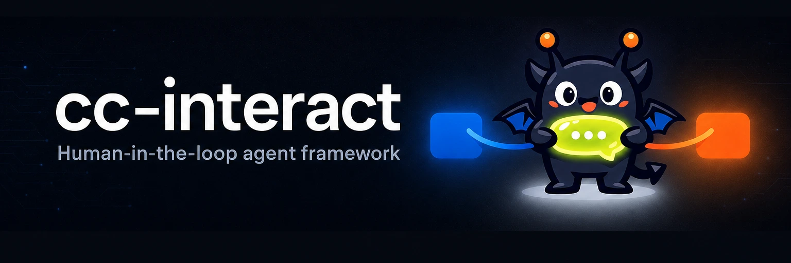

# cc-interact



[](https://github.com/yasyf/cc-interact/actions/workflows/ci.yml)
[](https://github.com/yasyf/cc-interact/blob/main/LICENSE)

A domain-agnostic framework for human-in-the-loop Claude agents — daemon, event stream, MCP channel, and optional web UI.

cc-interact is the substrate under [cc-review](https://github.com/yasyf/cc-review), lifted out: a long-living
Claude session and a human exchange messages over an MCP channel (or a `watch` stream), brokered by a daemon
that serves an HTTP API and a server-sent event plane, with state in SQLite. You bring a reducer and a handful
of handlers; it brings the daemon lifecycle, the append-only event log, the SSE plane, the edit gate, and an
optional React UI — so standing up a new human-in-the-loop agent surface is "register a few handlers," not
"rebuild the plumbing."

## Install

The core is a Go module:

```bash
go get github.com/yasyf/cc-interact
```

The browser UI is an opt-in npm package — pull it in only if you want one:

```bash
npm install @cc-interact/react
```

## Quickstart

`examples/echo` is the shortest complete consumer: a reducer, a couple of handlers, and one channel tool —
no browser, no SPA. It proves the core carries zero domain concepts and needs no frontend.

```bash
go run ./examples/echo
```

It starts the daemon, opens an MCP channel, and echoes each item posted to its REST API back over the event
stream — the same `/events` plane a browser would read.

## What problems does this solve?

- **Daemon plumbing you'd otherwise hand-roll.** Lazy spawn, newest-wins eviction, peer-credential identity, a single-writer SQLite with WAL, and a long-poll that frees parked goroutines on cancel — all shipped. You register handlers against a generic control envelope.
- **Realtime that's correct, not just live.** An append-only, gap-free event log and an SSE plane with at-least-once delivery and reconnect cursors, consumed identically by the browser and by the agent's own channel.
- **Human-in-the-loop gating.** An edit gate that blocks the agent's writes until the human responds — fail-closed, with the verdict and wording supplied by your domain, not the framework.
- **The web UI is optional.** A headless consumer talks to the same daemon over REST and an MCP channel; mount `@cc-interact/react` and the static handler only when you want a diff-style browser client.

## License

PolyForm-Noncommercial-1.0.0. See [LICENSE](https://github.com/yasyf/cc-interact/blob/main/LICENSE).
